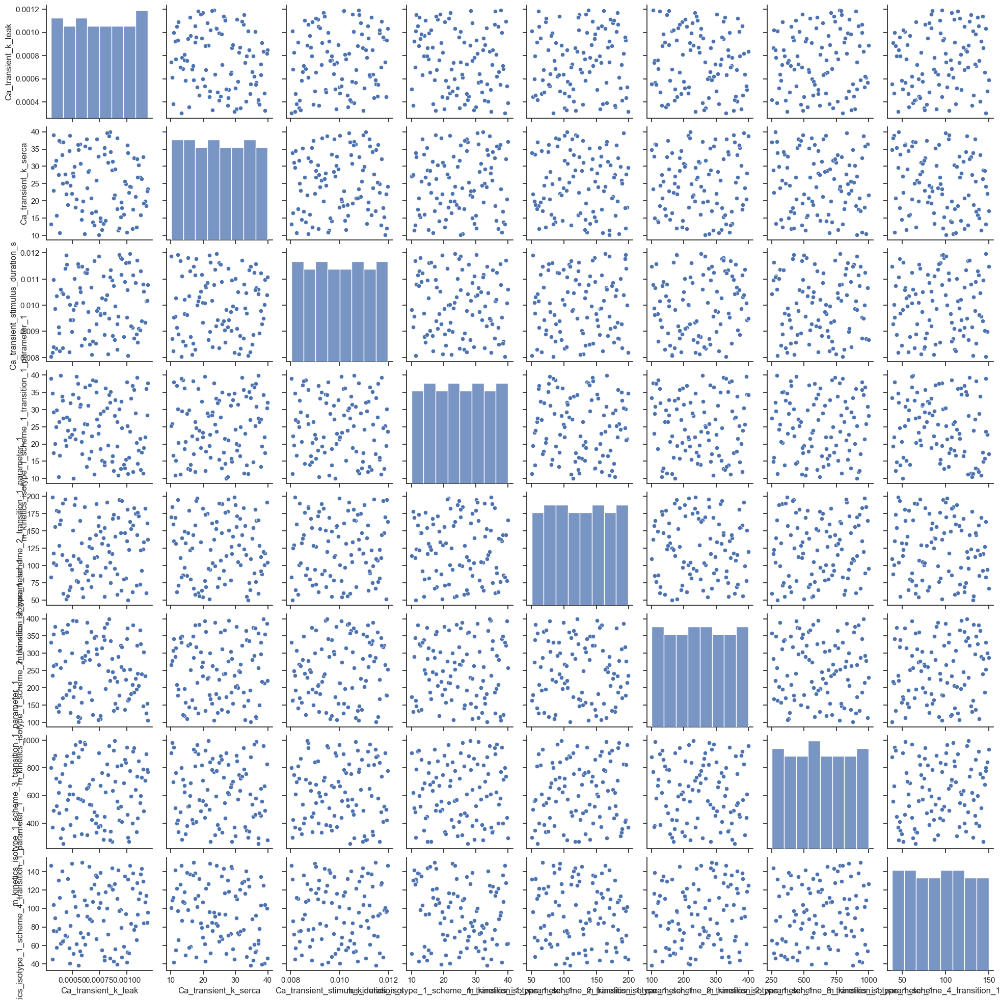
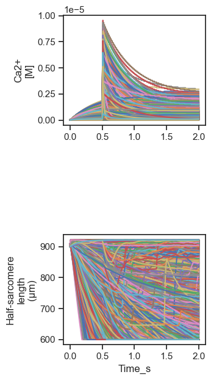
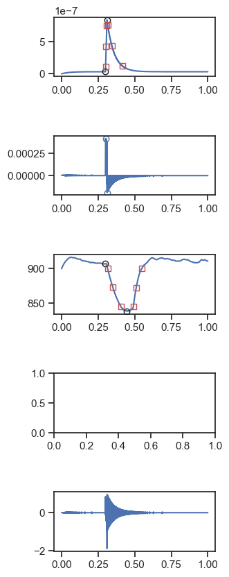
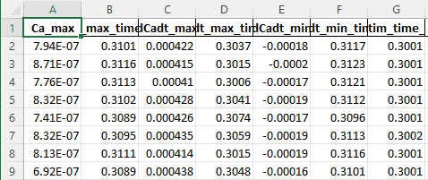

# FiberSim analysis of unloaded shortening

## Overview

This repo shows how to use [FiberSim](https://campbell-muscle-lab.github.io/FiberSim/) to generate simulations of unloaded shortening with model parameters selected from a user-defined range.

## Steps

You can run new FiberSim calculations to

+ generate your own simulations
+ analyse the data files included in this repo.

Running simulations requires a Windows computer and will take a while, particularly on a machine with a moderate number of threads. If you are interested in machine learning, it's probably best to skip to the analysis section for now.

### Running your own simulations

+ You will need a Windows computer.

+ Clone the [FiberSim repo](https://github.com/campbell-muscle-lab/FiberSim/)

+ Note the top directory for the repository. We will refer to this as `<FiberSim_repo>`.
  + As an example, it might be `d:/ken/github/campbellmusclelab/models/FiberSim`

+ Create the FiberSim environment. 
  + The environment file is `<FiberSim_repo>/code/FiberPy/environment/environment.yml`

+ Now clone this project repo. We will refer to this as `<Project_repo>`

+ Find `sampling_setup.json` in `<Project_repo>/test/base`

+ Open the json file in a text editor and change the path to the exe file in line 5 to match your hard drive.

  + As an example, it might change from<br>
    ````
    "exe_file": "d:/ken/github/campbellmusclelab/models/fibersim/bin/FiberCpp.exe"
    ````
    to
    ````
    "exe_file": "c:/temp/fibersim/bin/FiberCpp.exe"
    ````
+ Open an Anaconda prompt 

+ Activate the FiberSim environment

+ Change dirctory to `<FiberSim_repo>/code/FiberPy/FiberPy`

+ Run `python FiberPy.py sample <full path to your sampling_setup.json file>`

+ You should see a lot of stuff happening in your command prompt and eventually files appearing in `<Project_repo>/sim_data`

+ On Ken's PC with 128 threads, this demo will take ~30 minutes.

### Analyzing simulations

+ Open an Anaconda prompt

+ Activate the FiberSim environment

+ Change directory to `<Project_repo>/test/Python_code`

+ Run `python analyze_simulations.py`

+ You should see some action in the command window

+ Once the code has finished running, look in `<Project_repo>/test/analysis` for the following files

#### Pair_plot

`pair_plot.png` is a scatterplot matrix generated using seaborn for the parameter values that were tested in the simulations. The parameter values are stored in an Excel file in `<Project_repo>/test/sim_data/generated/parameter_values.xlsx`

The plot seems consistent with the Latin Hypercube sampling approach.



#### Summary

`summary.png` shows Ca transients and unloaded shortening profiles predicted by FiberSim for 100 combinations of parameter values.



#### Trace analysis

`<Project_repo>/test/analysis/images` contains 100 figures, each of which shows the analysis of a single simulation. Here is an example.



#### Analysis metrics

`<Project_repo>/test/analysis/analysis.xlsx` shows 35 metrics for each of the 100 simulations.

