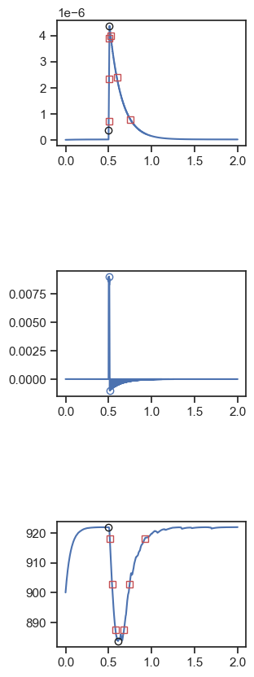

# FiberSim analysis of unloaded shortening

## Overview

This repo uses [FiberSim](https://campbell-muscle-lab.github.io/FiberSim/) to generate simulations of unloaded shortening with model parameters selected from a user-defined range.

This repo contains a "large" dataset with 10,000 trials, each of which was run with low tolerances. This took about 6 days to run on Ken's PC with 128 threads. It's unlikely that you want to re-create this dataset, although the intructions below show how you could.

If you simply want to access the results of the simulations and the subsequent analyses, you can download a zip file that contains the `sim_data` and `analysis` folders described below [from this link](https://luky.sharepoint.com/:u:/s/CampbellLab/EcX1vCWXI1hMi_MojM4ydVAB5rLANowP7mNDyYmrcoaH5Q?e=ShoLfm) (warning, 8 GB, Dixit, Brooke, and Stuart should have access via their Yale email addresses).

A demo showing how to run a much smaller calculation is available at [Latin hypercube sampling](https://campbell-muscle-lab.github.io/FiberSim/pages/demos/sampling/latin_hypercube/latin_hypercube.html)

## Steps

You can run new FiberSim calculations to

+ generate your own simulations
+ analyse the data files included in this repo.

Running the simulations requires a Windows computer. It will also take multiple days to recreate the full dataset of 10,000 trials.

Once all the simulations have finished, the analysis routines are launched automatically. This is much faster - about ~1 second per trial.

### Generate your own simulations

+ You will need a Windows computer.

+ Clone the [FiberSim repo](https://github.com/campbell-muscle-lab/FiberSim/)

+ Note the top directory for the repository. We will refer to this as `<FiberSim_repo>`.
  + As an example, it might be `d:/ken/github/campbellmusclelab/models/FiberSim`

+ Create the FiberSim environment. 
  + The environment file is `<FiberSim_repo>/code/FiberPy/environment/environment.yml`

+ Now clone this project repo. We will refer to this as `<Project_repo>`

+ Find `setup.json` in `<Project_repo>/test/base`

+ Open the json file in a text editor and change the path to the exe file in line 5 to match your hard drive.

  + As an example, it might change from<br>
    ````
    "exe_file": "d:/ken/github/campbellmusclelab/models/fibersim/bin/FiberCpp.exe"
    ````
    to
    ````
    "exe_file": "c:/temp/fibersim/bin/FiberCpp.exe"
    ````
+ Open an Anaconda prompt 

+ Activate the FiberSim environment

+ Change dirctory to `<FiberSim_repo>/code/FiberPy/FiberPy`

+ Run `python FiberPy.py sample <full path to your setup.json file>`

+ You should see a lot of stuff happening in your command prompt and eventually files appearing in `<Project_repo>/sim_data`

+ On Ken's PC with 128 threads, running the full set of simulations took ~6 days.

### Analyzing simulations

**Note** - if you downloaded the zip file containing the results and analyses of the simulations (see [Overview](#overview)), extract the zip folder into `<Project_repo>/test`. That should create `<Project_repo>/test/sim_data` and `<Project_repo>/test/analysis` folders and preserve the paths described below.

+ FiberPy analyzes the simulations by calling `<Project_repo>/test/Python_code/analyze_simulations.py`. This is launched automatically after the last trial has finished.

+ You should see some action in the command window

+ Once the code has finished running, look in `<Project_repo>/test/analysis` for the following files

#### Pair_plot

`pair_plot.png` is a scatterplot matrix generated using seaborn for the parameter values that were tested in the simulations.

The plot seems consistent with the Latin Hypercube sampling approach. Note that the parameters were selected from a log-scale but that the scatterplot matrix uses linear scaling. This explains the exponential distribution of the histograms.


The parameter values used to for each of the 10,000 trials are stored in an Excel file in `<Project_repo>/test/sim_data/generated/parameter_values.xlsx`


#### Summary

`summary.png` shows Ca transients and unloaded shortening profiles predicted by FiberSim for 10,000 combinations of parameter values.


#### Trace analysis

`<Project_repo>/test/analysis/images` contains 10,000 figures, each of which shows the analysis of a single simulation. Here is an example (`sim_1197.png`)showing a "good" twitch.



Note that many of the simulations show "non-twitch" like behavior. This example (`sim_1196.png`) shows a cell that shortens down to its minimum length.


#### Analysis metrics

`<Project_repo>/test/analysis/analysis.xlsx` shows >30 metrics for each of the 10,000 simulations.

